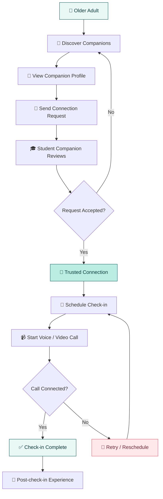

 
<div align="center">


# 💚❤️📱 CareLink

### Meaningful Connections. Brighter Days.


**An accessible, human-centered companionship and check-in application connecting older adults with trusted student companions.**

<br/>


<br/>

**🎓 Sri Lanka Institute of Information Technology (SLIIT)**

**IT3060 — Human Computer Interaction | Group WE_60**

[Overview](#overview) • [Features](#features) • [User Journey](#user-journey) • [Tech Stack](#technology-stack) • [Installation](#getting-started) • [Testing](#quality-assurance) • [Team](#team--collaboration)

</div>

---

<a id="overview"></a>

## 🌿 Overview

**CareLink** is a Flutter-based mobile application designed to help older adults build meaningful social connections through trusted companionship and scheduled check-ins.

Developed as part of the **IT3060 — Human Computer Interaction (HCI)** module at the **Sri Lanka Institute of Information Technology (SLIIT)**, CareLink explores how thoughtful interaction design can make digital companionship more accessible, comfortable, and reassuring.

By connecting older adults with verified student companions, CareLink supports regular conversations, trusted relationships, and simple check-in experiences.

> 💚 **Our mission:** Make meaningful companionship accessible through technology that feels simple, safe, respectful, and human.

### ✨ Project Status

**Academic project — Active Development**

The Older Adult and Student Companion flows described in this README have been implemented and tested in the team's reported development work.

Family Caregiver and Community Coordinator functionality forms part of the wider CareLink design scope and may still be under development.

CareLink is an academic application and should not be represented as a production emergency-response or professional healthcare service.

---

## 💡 The Problem We're Solving

Loneliness and social isolation can affect older adults, especially when opportunities for regular conversation and meaningful social interaction are limited.

Many existing digital platforms can also be difficult for older adults to navigate because of complicated interfaces, unclear instructions, and small interaction targets.

At the same time, families and community coordinators need privacy-conscious ways to support companionship without removing an older adult's independence.

### 🌱 Our Solution

CareLink brings together four important ideas:

| 🤝 Companionship | 📅 Consistency |
|:---:|:---:|
| Trusted student connections that encourage meaningful conversations. | Scheduled and recurring check-ins that help maintain regular contact. |

| 🛡️ Trust & Consent | 💚 Accessibility |
|:---:|:---:|
| Privacy-aware interactions and permission-based visibility. | Simple navigation, readable interfaces, and clear actions for older adults. |

---

## 🎯 Our Vision

**A world where growing older never means growing disconnected.**

CareLink aims to provide an experience where technology supports people rather than overwhelming them.

Our design priorities are:

- 🧓 **Accessibility First** — Elder-friendly controls, readable typography, and intuitive navigation.
- 🤝 **Meaningful Connections** — Encouraging trusted intergenerational companionship.
- 🔐 **Privacy & Consent** — Respecting personal choices and boundaries.
- 📅 **Reliable Routines** — Making scheduled companionship easy to manage.
- 💬 **Comfortable Communication** — Clear voice and video check-in experiences.
- 🌏 **Inclusive Design** — Supporting multilingual interaction and different digital confidence levels.

---

## 👥 User Roles

CareLink considers four primary user roles.

| Role | Description | Primary Focus |
|---|---|---|
| 🧓 **Older Adult** | Connects with trusted student companions. | Discovery, scheduling, check-ins, connection management |
| 🎓 **Student Companion** | Builds and manages companionship connections. | Requests, matching, scheduling, voice/video participation |
| 👨‍👩‍👧 **Family Caregiver** | Receives appropriately permissioned reassurance. | Consent-based family awareness |
| 🛡️ **Community Coordinator** | Supports the human-led safety workflow. | Coordination, missed-session review, appropriate follow-up |

**Implementation note:** The first two roles have the most developed flows described in this README. The other roles remain part of the broader project scope.

---

<a id="features"></a>

## 🚀 Key Features

### 🧓 01. Older Adult Experience

The Older Adult experience focuses on making companionship and check-ins easy to understand and manage.

**Highlights**

- Discover suitable student companions.
- View companion profiles and matching information.
- Send companionship connection requests.
- Manage active connections.
- Schedule regular check-ins.
- View upcoming check-ins.
- Reschedule sessions.
- Start voice or video calls.
- View check-in completion states.
- Experience large, clear, accessible interface controls.

### 🎓 02. Student Companion Experience

The Student Companion flow supports responsible participation in companionship activities.

**Highlights**

- Review older-adult connection requests.
- Accept or decline requests.
- View active companionship connections.
- Manage pause, resume, and end-connection flows.
- View scheduled check-ins.
- Participate in voice and video calls.
- Access relevant companion and conversation information.

### 🤝 03. Companion Discovery & Matching

CareLink's matching experience considers meaningful compatibility details.

| Matching Factor | Purpose |
|---|---|
| 🌐 **Language** | Help participants communicate comfortably. |
| 💬 **Interests** | Encourage enjoyable conversations. |
| 📅 **Availability** | Support suitable check-in schedules. |
| 👤 **Companion Profiles** | Help users make informed connection decisions. |
| ✅ **Verification** | Support trust and transparency. |

### 📅 04. Smart Check-in Scheduling

Check-in scheduling helps older adults maintain predictable companionship routines.

**Core scheduling interactions**

- Create check-ins.
- Create recurring schedules.
- View scheduled sessions.
- Identify upcoming check-ins.
- Reschedule an existing check-in.
- Manage cancellations.
- Share relevant schedule state between connected participants.

### 📹 05. Voice & Video Check-ins

CareLink uses **WebRTC (`flutter_webrtc`)** for the voice and video calling functionality described in the implemented flows.

Supported call interactions include:

- Microphone controls
- Camera controls
- Supported speaker controls
- Call initiation and answering
- Call cancellation
- Connected-call state
- Call ending
- Post-call completion experience

> ⚠️ **Call integrity:** An unanswered, cancelled, or never-connected call must not be recorded as a successfully completed check-in.

A completed check-in must follow the appropriate connected-call lifecycle.

### 💚 06. Post-Check-in Experience

After a successfully completed check-in, the interface can present a clear completion state and wellbeing reflection.

The aim is to make the end of the conversation understandable and reassuring rather than confusing.

### 🌍 07. Multilingual Support

CareLink incorporates multilingual support in the companion-matching and connection-management flows.

| Language | Support |
|---|---|
| 🇬🇧 English | Supported in the described multilingual flows |
| 🇱🇰 Sinhala | Supported in the described multilingual flows |
| 🇱🇰 Tamil | Supported in the described multilingual flows |

Localization coverage across additional screens should be validated during integration.

### 🛡️ 08. Wider HCI Design Features

The larger CareLink research and prototype scope also includes:

- Family visibility
- Consent management
- Safety notifications
- Missed-session follow-up
- Memory Lane and memory sharing
- Wellbeing support
- Coordinator oversight

These areas are part of the approved design direction. Their full backend integration should be checked individually rather than assumed complete.

---

<a id="user-journey"></a>

## 🔄 The CareLink User Journey

<div align="center">

### From a First Hello to a Meaningful Connection

</div>



### How It Works

**Step 01 — Discover**

The older adult reviews recommended companions and their profiles.

**Step 02 — Connect**

A companionship request is sent and can be reviewed by the student companion.

**Step 03 — Build Trust**

Once accepted, an active connection supports further companionship interactions.

**Step 04 — Schedule**

The older adult creates a suitable check-in schedule.

**Step 05 — Communicate**

The participants join a voice or video conversation.

**Step 06 — Complete**

A genuinely connected and completed call can produce a check-in completion state.

**Step 07 — Continue**

The participants may manage their connection and future check-in routines.

---

<a id="technology-stack"></a>

## 🛠️ Technology Stack

<div align="center">


</div>

| Layer | Technology | Purpose |
|---|---|---|
| 📱 **Frontend** | Flutter | Cross-platform application UI |
| 💻 **Language** | Dart | Application development |
| 🔐 **Authentication** | Firebase Authentication | User authentication |
| ☁️ **Database** | Cloud Firestore | Realtime and persistent application data |
| 📹 **Calling** | WebRTC (`flutter_webrtc`) | Voice/video check-ins |
| 🔄 **Signaling** | Firestore | Calling coordination |
| 🛠️ **Development** | VS Code, Android tooling | Development and debugging |
| 🌐 **Web Testing** | Google Chrome | Browser-based testing |
| 🧪 **Quality Assurance** | Flutter tests, static analysis | Automated checks |
| 🌿 **Version Control** | Git & GitHub | Collaboration and source management |

**Team Firebase Project:** `carelink-hci`

Access to the Firebase project and its configuration must be granted separately.

---

## 🏗️ Architecture & Project Organization

CareLink follows a feature-oriented Flutter project structure.

```text
CareLink-App/
│
├── android/                  # Android platform
├── ios/                      # iOS platform
├── web/                      # Web support
├── assets/
│   └── images/               # Images and brand assets
│
├── lib/
│   ├── app/                  # Application configuration
│   │
│   ├── features/
│   │   ├── elder/            # Older Adult functionality
│   │   ├── companion/        # Companion and matching functionality
│   │   └── calls/
│   │       └── services/     # Calling and signaling services
│   │
│   └── main.dart
│
├── test/                     # Flutter widget tests
│
├── pubspec.yaml              # Dependencies and assets
└── README.md                 # Project documentation
```

**Compatibility note:** Some Dart files may remain as compatibility exports pointing to newer `elder_...` implementations. Preserve the export file and its target when moving or merging code.

---

<a id="getting-started"></a>

## ⚙️ Getting Started

### 📋 Prerequisites

Before running CareLink, prepare the following:

- Flutter SDK and Dart
- VS Code or Android Studio
- Flutter and Dart editor extensions
- Git
- Chrome or a supported Android device/emulator
- Access to the team's Firebase configuration

### 📥 1. Clone the Repository

```bash
git clone https://github.com/LithiraLiyanage/CareLink-App.git
cd CareLink-App
```

### 📦 2. Install Dependencies

```bash
flutter pub get
```

### 🔍 3. Check Available Devices

```bash
flutter devices
```

### 🌐 4. Run in Chrome

```bash
flutter run -d chrome
```

### 📱 5. Run on Android

Connect an Android device or launch an Android emulator.

Then run:

```bash
flutter run
```

### 🩺 6. Check Your Flutter Environment

```bash
flutter doctor
```

If Android SDK licenses still require approval:

```bash
flutter doctor --android-licenses
```

### 🔥 Firebase Configuration

Authenticated and Firestore-backed features require the correct Firebase configuration for the selected platform.

**Important:**

- Request access to the team's `carelink-hci` Firebase project.
- Use the configuration appropriate to the selected platform.
- Never commit private credentials or service-account keys.
- Validate Firestore Security Rules for the relevant user roles.
- Do not assume that a successful UI build confirms backend connectivity.

### 🎙️ Camera & Microphone Permissions

Voice and video calls require appropriate camera and microphone permissions.

Browser-based calling should be tested through `localhost` or another secure context.

For a real end-to-end call test, use two separate authenticated participants and verify signaling, peer connection, and completion behavior.

---

## 🎨 Human-Centered UI / UX

CareLink is designed around the needs of users with different levels of digital confidence.

### Our Design Principles

| Principle | Design Goal |
|---|---|
| 🧓 **Elder-Friendly Navigation** | Simple journeys and clear primary actions |
| 👆 **Comfortable Touch Targets** | Controls that are easier to select |
| 🔎 **Readable Interfaces** | Clear labels and understandable hierarchy |
| 💬 **Helpful Feedback** | Visible results and recovery paths |
| 🎨 **Consistent Design Language** | Deep teal, aqua, coral, and calm surfaces |
| 🔐 **Consent-First Design** | Respectful sharing and visible privacy choices |
| 🌍 **Language Accessibility** | Multilingual readability |
| ❤️ **Human Connection** | Warm, reassuring experiences |

### 🎨 CareLink Design Palette

<div align="center">


</div>

The CareLink palette balances calm, trustworthy colors with clearly visible actions.

- **Deep teal:** Trust, comfort, primary navigation, and stability.
- **Coral red:** Important actions and friendly emphasis.
- **Mint / aqua:** Supporting information, selected states, and accessible highlights.
- **Off-white:** Clean, uncluttered backgrounds.

---

## 🧠 Our HCI Design Process

Our development follows a user-centered design approach.


### 🔎 Research & Discovery

Understanding the needs and challenges of older adults through research activities such as interviews, questionnaires, user walkthroughs, and empathy mapping.

### 🧑 Personas & User Journeys

Translating research findings into personas, user stories, functional requirements, and clearly defined role-based journeys.

### ✏️ Sketching & Wireframing

Exploring alternative screen designs and selecting clearer layouts based on usability and accessibility.

### 🎨 Interactive Prototyping

Developing low- and high-fidelity prototypes that represent the CareLink user journeys.

### 💻 Flutter Implementation

Translating approved design decisions into reusable application screens and integrating appropriate services.

### 🧪 Evaluation & Refinement

Evaluating task completion, navigation, errors, clarity, confidence, and accessibility to inform ongoing improvements.

---

<a id="quality-assurance"></a>

## ✅ Quality Assurance

Code quality and functional testing are important parts of the CareLink development workflow.

### Automated Checks

Run the following commands before sharing or merging changes:

```bash
flutter analyze
flutter test
```

### 📊 Last Reported Verification — October 2026

| Check | Last Reported Result |
|---|---|
| Flutter Static Analysis | ✅ No issues found |
| Flutter Test Suite | ✅ 99 / 99 tests passed |

> These are the team's last reported results for the tested commit. They are not a guarantee that future commits, all devices, or live network/calling conditions will pass without further testing.

### Recommended Manual Testing

| Test Scenario | What to Verify |
|---|---|
| Companion discovery | Profiles and matching information are understandable |
| Connection requests | Accept and decline states work correctly |
| Connection management | Pause, resume, and end actions update correctly |
| Recurring schedules | Sessions can be created and viewed |
| Rescheduling | Updated session information is clear |
| Voice/video calling | Actual connection and controls work |
| Cancelled/unanswered calls | Check-in is not incorrectly marked completed |
| Check-in completion | Completion follows a genuinely connected call |
| Mobile responsiveness | Layout remains readable on smaller screens |
| Localization | Translated labels remain usable |

---

## 🔐 Privacy, Consent & Safety

CareLink works with potentially sensitive user, connection, and check-in information.

Our privacy-aware implementation principles include:

- 🔒 Authenticated access to protected functionality.
- 👤 Appropriate role-based visibility.
- 🛡️ Firestore Security Rules.
- 🤝 Explicit consent where applicable.
- 📋 Minimal collection of personal information.
- 🚫 No exposure of private conversation content to family or audit views.
- ✅ Respect for consent withdrawal and access changes.
- 🧑‍💼 Human-led review of safeguarding concerns.

### Important Safety Boundary

**CareLink is not an emergency-response system, medical-monitoring platform, or replacement for professional care.**

Its primary purpose is meaningful companionship and scheduled social interaction.

---

<a id="team--collaboration"></a>

## 🤝 Team & Collaboration

Developed as part of **IT3060 — Human Computer Interaction** by **Group WE_60** at SLIIT.

### Development Areas

| Area | Responsibility |
|---|---|
| 🔐 Authentication & Trust | Login, registration, profiles, verification, consent |
| 🧓 Elder Experience | Check-ins, recurring schedules, call journeys, wellbeing and Memory Lane |
| 🎓 Companion Experience | Matching, connections, requests, conversation support |
| 🛡️ Family & Safety | Family visibility, notifications, coordination and safety flows |

### 🌿 Git Workflow

We use Git and GitHub to manage development and collaboration.

```bash
git status
flutter analyze
flutter test
```

Changes should be developed on appropriate feature branches, tested, reviewed, and merged into the integrated application.

**Collaboration practices:**

- Keep commits focused and descriptive.
- Avoid unrelated changes to teammates' modules.
- Preserve required compatibility exports during refactoring.
- Review shared-service and navigation changes.
- Do not commit credentials or sensitive local configuration.
- Verify the integrated app after merging.

---

## 🎓 Academic Information

| Detail | Information |
|---|---|
| **Project Name** | CareLink |
| **Module** | IT3060 — Human Computer Interaction |
| **Institution** | Sri Lanka Institute of Information Technology |
| **Group** | WE_60 |
| **Application** | Elderly Companionship & Check-in App |
| **Platform** | Flutter / Dart |
| **Project Type** | Academic Development Project |

---

## 💚 Why CareLink Matters

Technology should bring people closer together.

For older adults, even a small conversation can create a sense of belonging, reassurance, and emotional connection.

CareLink is built around that simple idea:

**Companionship should be accessible. Trust should be visible. Technology should feel human.**

---

<div align="center">


### ❤️ CareLink

**CONNECT · CARE · COMFORT**

*Meaningful Connections. Brighter Days.*

<br/>


---


### 📲 Group Members

**👨‍💻 LIYANAGE L.D**
**👨‍💻 OBBRIS M.W.S**
**👩🏼‍💻 WIJESINGHE W.M.R.C**
**👩🏼‍💻 KARUNARATHNA J.M.M.Y**


---


**Built with care for better connections.**

</div>
